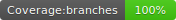

# badges4cov

   

Yes, another image badges generator for nyc coverage json report. I tried more than 3 options from google and no one worked for me. So, I created a new one!!

## usage

Install the package:

`npm install https://github.com/jrichardsz/badges4cov.git`

Ensure that your nyc creates the json summary adding the parameter `--reporter=json-summary`

```
"scripts": {
    "test": "nyc --reporter=json-summary mocha  '**/*.test.js'",
}
```

Generate the four standard badges adding this script and executing it

```
"scripts": {
    "badges": "badges4cov --source=nyc_json --nyc_json_file_location=./coverage/coverage-summary.json --output_folder=./coverage"
}
```

## direct usage

Install globally the package:

`npm install https://github.com/jrichardsz/badges4cov.git -g`

Run:

```
badges4cov --source=nyc_json --nyc_json_file_location=/foo/coverage-summary.json --output_folder=/bar
```

If the **coverage-summary.json** exist, you should see this log:

```
detected coverage metrics
{ lines: 45, statements: 69, functions: 10, branches: 89 }
created badge: /bar/lines.svg
created badge: /bar/statements.svg
created badge: /bar/functions.svg
created badge: /bar/branches.svg
```

## Road map

- [ ] add lcov support
- [ ] add png support
- [ ] publish to npm repository: https://www.npmjs.com/package/repository

## Contributors

<table>
  <tbody>
    <td>
      
      <br />
      <label><a href="http://jrichardsz.github.io/">JRichardsz</a></label>
      <br />
    </td>    
  </tbody>
</table>
